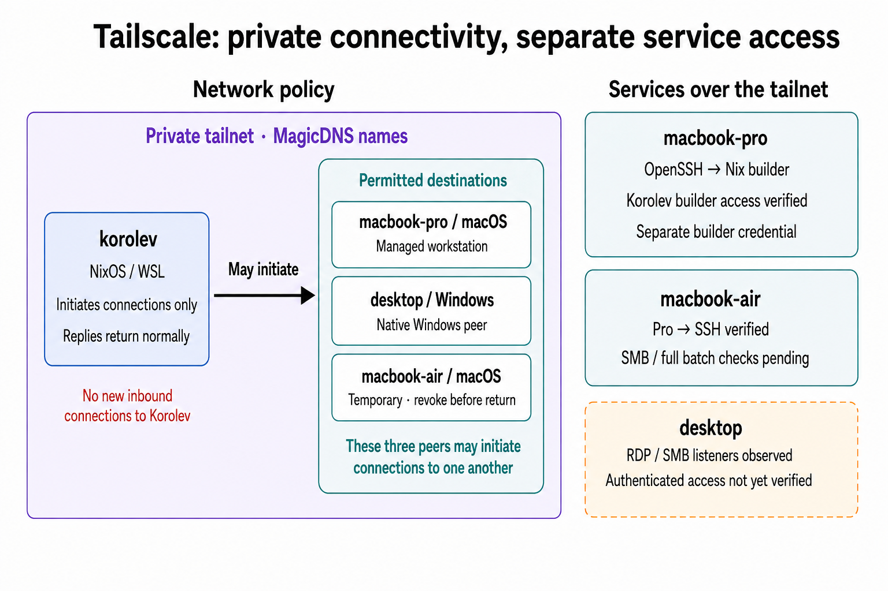

# nix-config

Personal workstation configuration for an Apple Silicon MacBook Pro and NixOS under WSL 2. The flake also renders a separately applied Windows configuration and manages [DNS](dns/dnsconfig.js).

## System overview

| Host          | Platform         | Configuration                               |
| ------------- | ---------------- | ------------------------------------------- |
| `macbook-pro` | `aarch64-darwin` | [nix-darwin](hosts/macbook-pro/default.nix) |
| `korolev`     | `x86_64-linux`   | [NixOS/WSL](hosts/korolev/default.nix)      |

Nix owns the host configuration and OMP wrapper, updater, plugin, and language tools. `omp-dev-update` prepares patched OMP source generations independently on each host. OMP owns its writable authentication, configuration, sessions, and databases; activation and Nix rollback do not replace them. Project repositories own their development environments.

[](docs/images/system-overview.webp)

## Network

Tailscale connects the managed hosts, personal Windows desktop, and temporary MacBook Air. Korolev can initiate connections but does not accept inbound connections.

[](docs/images/tailscale-overview.webp)

The diagram shows topology only. Its service cards predate the desktop's verification and no longer describe current state; [the change evidence](openspec/changes/archive/2026-09-06-enable-native-windows-remote-work/evidence.md) is authoritative.

### Desktop SSH and file access

After Mac activation, `ssh desktop` opens the Windows account's PowerShell session. Use `ssh desktop-batch 'exit 23'` for unattended commands and `sftp desktop-batch` for transfers. The batch endpoint preserves stdin, disables terminal allocation and connection persistence, and uses an eight-second connection timeout.

Both desktop endpoints require the declared host-key pin and reject password fallback. The selected Windows account has administrator privileges; privileged service changes still require explicit owner approval. Windows absolute SFTP paths use `/D:/Projects/ynab`, not `D:/Projects/ynab`. Keep working copies on local storage and preserve originals during transfers.

Graphical access uses Windows App from this Mac against `desktop.tail8768af.ts.net`. The desktop allows one session per user and boots into a signed-in session, so a connection takes over that session rather than opening a private one, and disconnecting retains its work. The Air and Korolev have no RDP client by design; they use SSH and SFTP.

The desktop access change records [acceptance evidence](openspec/changes/archive/2026-09-06-enable-native-windows-remote-work/evidence.md) and [completed deployment gates](openspec/changes/archive/2026-09-06-enable-native-windows-remote-work/tasks.md). The verified standalone Windows OpenSSH server supports hybrid post-quantum key exchange. Its [manual update and recovery procedure](docs/operations/dependency-updates.md#desktop-openssh-maintenance) preserves host keys and tailnet restrictions; client cryptography warnings remain enabled.

## Develop

With Nix and flakes installed, enter the pinned environment. It installs the commit hook; `direnv allow` uses the same shell.

```sh
nix develop
```

Run release gates in order from the repository root, using each host's installed Nix. Finish each Nix command before starting the next; concurrent evaluations of this flake can contend on the shared SQLite evaluation cache.

```sh
nix fmt -- --fail-on-change
nix flake check --print-build-logs
```

Run these additional gates on the Mac:

```sh
nix run .#check-darwin-build-plans
nix build .#darwinConfigurations.macbook-pro.system
```

The build-plan guard needs Darwin store access outside a check sandbox. It rejects uncached source-built toolchains and language servers. [CI](.github/workflows/check.yml) checks both platforms; a local flake check checks only its own system. With the Mac connected to the tailnet, Korolev can build both systems:

```sh
nix flake check --all-systems --print-build-logs
```

Permanent behavior changes use [OpenSpec](openspec/). [Agent guidance](AGENTS.md) explains the repository workflow.

## Activate

Review and merge first. Keep the previous generation and read activation output. For Mac networking changes, retain a local administrator terminal for recovery.

On the Mac, keep this clone at `~/.config/nix-darwin`. First activation:

```sh
sudo nix run .#darwin-rebuild -- switch --flake .#macbook-pro
```

Later activations use `darwin-switch`, which also prints the closure diff. On Korolev, activate from the committed repository:

```sh
sudo nixos-rebuild switch --flake .#korolev
```

Run `verify-personal-omp` afterward. It reports the selected release and commits, OMP version, plugin store path, and current Herdr integration. After OMP or plugin behavior changes, also complete the [release smoke](docs/operations/dependency-updates.md#release-smoke).

For a new Windows machine, follow [WSL and Windows provisioning](docs/operations/wsl-omp-bootstrap.md). It covers image import, credentials, the separate Windows apply, and recovery. Run one WSL distribution at a time; confirm `systemctl is-active user@1000.service` reports `active` before activation.

For local containers on the Mac, use the [container lifecycle and recovery procedure](docs/operations/container-runtime.md). Activation does not start or delete the VM.

## Update

The central [dependency automation](https://github.com/glockyco/dependency-automation) opens review-only Nix-input PRs every Saturday. Renovate updates GitHub Actions. Neither merges or activates hosts. Plannotator stays at an explicitly selected vendor revision. [Dependency operations](docs/operations/dependency-updates.md) covers on-demand Plannotator updates, external authorization, and release recovery.

For a manual Nix update, choose one command, review the diff, then run the gates above:

```sh
nix flake update                       # all inputs
nix flake update personal-omp-plugin   # plugin only
```

For an agent-led update, open this repository in a fresh OMP session and request an update or invoke `/skill:omp-update`. The [repository skill](.agents/skills/omp-update/SKILL.md) follows the [complete update procedure](docs/operations/dependency-updates.md#agent-led-omp-updates), including patch repair and runtime verification.

On macbook-pro and korolev, initialize or update the patched OMP runtime explicitly:

```sh
omp-dev-update
omp
```

The updater checks a host-native source generation before selecting it. It installs the native addon that upstream published for that release, after an integrity and provenance check, and compiles the addon only when the pinned patches change native sources. Downloaded packages stay in one cache under `~/.local/share/omp-dev/cache`; removing that directory changes no generation. Failed updates leave the current generation unchanged. The [patch input](packages/omp-dev-update.nix) is pinned; changing the maintained patches requires a reviewed pin update. Normal sessions retain the immutable plugin and language tools. Use `omp-dev-update --rollback` for [OMP recovery](docs/operations/dependency-updates.md#omp-version-recovery), not `omp update` or Nix rollback.

Run the verifier and applicable release smoke before accepting the update.

## Recover

Keep the previous generation until all applicable gates and smoke checks pass. List and restore Nix generations on the affected host:

```sh
# macOS
sudo darwin-rebuild --list-generations | cat
sudo darwin-rebuild --rollback

# Korolev
sudo nixos-rebuild list-generations | cat
sudo nixos-rebuild switch --rollback --no-reexec
```

Then repeat verification. Nix rollback restores immutable tools, not OMP versions, credentials, tailnet enrollment, or application data. For a rejected OMP release, use [source-generation recovery](docs/operations/dependency-updates.md#omp-version-recovery). Windows configuration has no generation rollback.
